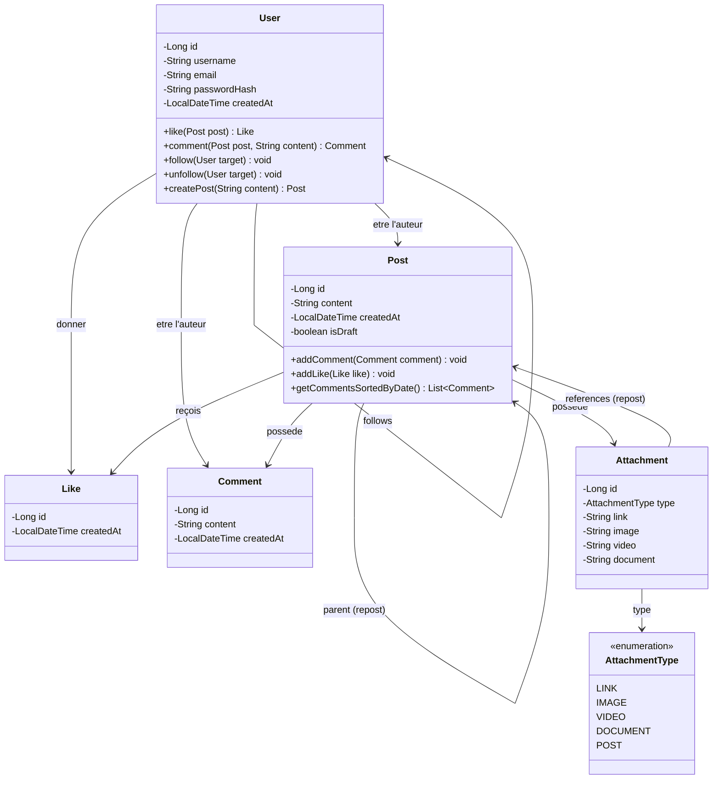

# Miniature

Réseau social minimaliste développé en Java avec une architecture MVC stricte (Servlets / JSP / Tomcat embarqué), réalisé dans le cadre du Brief 6 Simplon.

---
## Diagramme de Cas d'Utilisation


--- 

## Diagramme de classe



---

## Prérequis

- Java 21 ou supérieur
- Gradle 9.x (ou utiliser le wrapper `./gradlew` inclus)
- Aucune base de données requise — les données sont entièrement en mémoire

---

## Lancer l'application

Cloner le dépôt :

```bash
git clone https://github.com/titus-79/miniature.git
cd miniature
```

Compiler et démarrer le serveur Tomcat embarqué :

```bash
./gradlew run
```

L'application est ensuite accessible à l'adresse :

```
http://localhost:8080
```

---

## Comptes de test

Cinq comptes sont pré-chargés au démarrage. Ils partagent tous le même mot de passe.

| Nom d'utilisateur | Email              | Mot de passe  |
|-------------------|--------------------|---------------|
| alice             | alice@mail.com     | password123   |
| bob               | bob@mail.com       | password123   |
| harry             | harry@mail.com     | password123   |
| camille           | camille@mail.com   | password123   |
| leon              | leon@mail.com      | password123   |

---

## Fonctionnalités

### Gestion des utilisateurs
- Inscription avec hachage du mot de passe via BCrypt
- Connexion avec vérification BCrypt (`checkpw`)
- Session utilisateur via `HttpSession`
- Déconnexion avec invalidation de session

### Fils d'actualité
- Fil "Recommandations" : tous les posts de la plateforme, triés par date décroissante
- Fil "Abonnements" : posts des utilisateurs suivis uniquement

### Publications
- Création d'un post depuis le fil d'actualité
- Affichage de l'auteur et de la date de publication

### Interactions
- Liker / unliker un post (toggle, un seul like par utilisateur)
- Commenter un post depuis la page de détail
- Commentaires imbriqués (réponses à un commentaire) avec indentation dynamique
- Suivre / ne plus suivre un utilisateur

---

## Architecture

Le projet suit une architecture MVC stricte :

```
src/main/
    java/fr/simplon/
        App.java                      Point d'entrée, démarrage Tomcat embarqué
        models/
            User.java
            Post.java
            Comment.java
            Like.java
            Attachment.java
            AttachmentType.java
        repositories/
            UserRepository.java       Données en mémoire + seed utilisateurs
            PostRepository.java       Données en mémoire + seed posts/commentaires
        controllers/
            LoginController.java
            RegisterController.java
            FeedController.java
            PostController.java
            LikeController.java
            CommentController.java
            FollowController.java
    webapp/
        WEB-INF/views/
            feed.jsp
            post.jsp
        index.jsp
        login.jsp
        register.jsp
        style.css
```

Principes appliqués :

- Les Servlets reçoivent les requêtes, manipulent les données et transmettent les attributs à la vue via `request.setAttribute()`
- Les JSP n'ont aucune logique métier, elles affichent uniquement ce que le Servlet leur prépare
- Les vues protégées sont placées sous `WEB-INF` et ne sont accessibles que via `RequestDispatcher.forward()`
- Le pattern Post/Redirect/Get est respecté pour éviter la resoumission de formulaires

---

## Choix techniques

- **Tomcat 11 embarqué** : aucune installation de serveur externe nécessaire, le serveur démarre avec l'application via `./gradlew run`
- **BCrypt (jbcrypt 0.4)** : les mots de passe ne sont jamais stockés en clair ; chaque hash intègre son propre sel aléatoire
- **Données en mémoire** : pas de base de données pour cette version, toutes les données sont initialisées au démarrage via des repositories statiques
- **Java 21** : utilisation des API Jakarta Servlet avec annotations `@WebServlet`

---

## Documentation de conception

La conception du projet (diagrammes de classes, cas d'utilisation) est décrite dans le fichier `Brief_6_Miniature.md` à la racine du dépôt.

---

## Pistes d'évolution

- Persistance des données via JDBC (PostgreSQL, schéma SQL fourni dans le brief)
- Gestion des pièces jointes (lien, image, vidéo, document, repost)
- Profil utilisateur avec photo et biographie

## les méthode SOLID utiliser dans ce projet

## Listes des pattern

- Repository Pattern : IPostRepository / IUserRepository — abstraction de l'accès aux données. Les services ne savent pas si les données viennent d'une base, d'un fichier ou de la mémoire.
- Dependency Injection :AppContext construit tous les objets et les injecte via le ServletContext. Les classes reçoivent leurs dépendances de l'extérieur plutôt que de les créer elles-mêmes.
- Service Layer : AuthService, FeedService, PostService — couche intermédiaire entre les controllers et les repositories qui encapsule la logique métier.
- Use Case Pattern : LikePostUseCase, FollowUserUseCase — chaque action métier précise est isolée dans sa propre classe.
- MVC (Model View Controller)
          Model → domain/entities (Post, User, Comment...)
          View → les fichiers JSP
          Controller → les Servlets

## Listes des practice

- Injection de dépendances via constructeur : Les services reçoivent leurs dépendances dans le constructeur 
- Hashage des mots de passe : BCrypt pour stocker les mots de passe — jamais en clair.
- Optional : On utilise Optional<Post>, Optional<User> pour éviter les NullPointerException.
- Validation des entrées : Vérification que les paramètres HTTP ne sont pas null ou vides avant de les utiliser.
- Fail fast : On vérifie la session utilisateur en début de méthode et on redirige immédiatement si elle est null.
- Nommage expressif : getFollowingFeed(), togglePostLike(), resolvePost() — on comprend ce que fait la méthode sans lire son corps.

## Liste des principes

- DRY — Don't Repeat Yourself : La logique de recherche d'un post est centralisée dans PostService.getPost() — on ne la duplique pas dans chaque controller.
- KISS — Keep It Simple, Stupid : Chaque méthode fait une seule chose et reste courte. resolvePost() par exemple — simple et lisible.
- Separation of Concerns : Chaque couche a ses responsabilités clairement définies. Un JSP n'a pas de logique métier, un service n'a pas de logique HTTP.
- Low Coupling / High Cohesion : Les classes sont peu couplées entre elles (via les interfaces) et très cohésives (chaque classe regroupe ce qui va ensemble).
- Fail Fast : On détecte les erreurs le plus tôt possible — si la session est null, on redirige immédiatement sans aller plus loin.
- Convention over Configuration : Les noms des clés dans AppContext suivent une convention cohérente — "authService", "feedService", "postService".